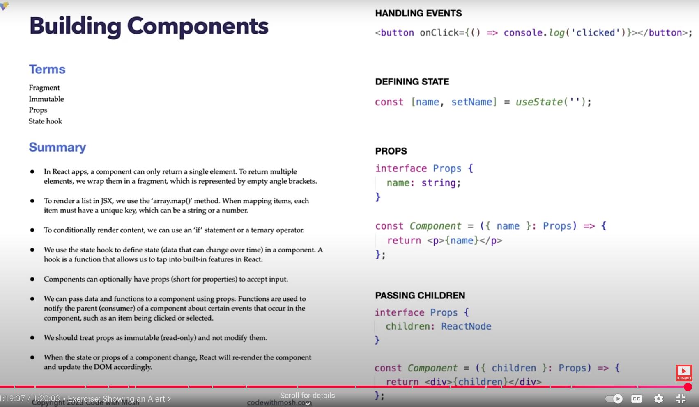

React returns only one element . But you can manuover it to return multiple elements. Use the following different ways:

1. Use **div** tag

```
function ListGroup() {
  return (
    <div>
      <h1>List</h1>
      <ul className="list-group"> // React.createElement('h1')
        <li className="list-group-item">An item</li>
        <li className="list-group-item">A second item</li>
        <li className="list-group-item">A third item</li>
        <li className="list-group-item">A fourth item</li>
        <li className="list-group-item">And a fifth one</li>
      </ul>
    </div>
  );
}


export default ListGroup;

```


2. Use **Fragment**

```
import { Fragment } from "react";

function ListGroup() {
  return (
    <Fragment>
      <h1>List</h1>
      <ul className="list-group"> // React.createElement('h1')
        <li className="list-group-item">An item</li>
        <li className="list-group-item">A second item</li>
        <li className="list-group-item">A third item</li>
        <li className="list-group-item">A fourth item</li>
        <li className="list-group-item">And a fifth one</li>
      </ul>
    </Fragment>
  );
}

export default ListGroup;

```
## Processes an array - a list of items

```
function ListGroup() {
  const items =["New York", "San Francisco", "Tokyo", "London", "Paris"]
  return (
    <>
      <h1>List</h1>
      <ul className="list-group"> 
        {items.map((item) => (
          <li>{item}</li>
        ))}  
      </ul>
    </>
  )};

export default ListGroup;
```

## Use of **key** element

Every **child** item must have an id for identification.
Meaning, in an **array** or **list**, each item should be assigned a key.

```
function ListGroup() {
  const items =["New York", "San Francisco", "Tokyo", "London", "Paris"]
  return (
    <>
      <h1>List</h1>
      <ul className="list-group"> 
        {items.map((item) => (
          <li key={item}>{item}</li>
        ))}  
      </ul>
    </>
  )};


export default ListGroup;
```


## Conditional Rendering
** Conditional Statements

```
 //Conditional Statements
function ListGroup() {
  //const items =["New York", "San Francisco", "Tokyo", "London", "Paris"]
  let items =["New York", "San Francisco", "Tokyo", "London", "Paris"];
  items =[];
  if (items.length === 0)
    
    return (
      <>
        <h1>List</h1>
        <p>No item found</p>
      </>
    );
  return (
    <>
      <h1>List</h1>
      <ul className="list-group"> 
        {items.map((item) => (
          <li key={item}>{item}</li>
        ))}  
      </ul>
    </>
  )};


export default ListGroup;
```

## Avoid Duplications
You can position your conditional statements or if statements inside a return statement in order avoid repetitions in a code.

```
function ListGroup() {
  
  let items =["New York", "San Francisco", "Tokyo", "London", "Paris"];
  items =[];

  return (
    <>
      <h1>List</h1>
      {items.length === 0 ? <p>No item found</p> : null}  
      <ul className="list-group"> 
        {items.map((item) => (
          <li key={item}>{item}</li>
        ))}  
      </ul>
    </>
  )};

export default ListGroup;
```

**null** means nothing will be rendered


## Minimize the Statements
Using this logic inside a return statement can later become too many and complicated for our jsx markup:

{items.length === 0 ? <p>No item found</p> : null} 

+ Store your logics inside a separate **variable** as in **var** or **constant** as in **const**


```
 
function ListGroup() {
  //const items =["New York", "San Francisco", "Tokyo", "London", "Paris"]
  let items =["New York", "San Francisco", "Tokyo", "London", "Paris"];
  items =[];

  const message = items.length === 0 ? <p>No item found</p> : null;

  return (
    <>
      <h1>List</h1>
      {message}  
      <ul className="list-group"> 
        {items.map((item) => (
          <li key={item}>{item}</li>
        ))}  
      </ul>
    </>
  )};


export default ListGroup;
```

## Another style used to clean up our jsx markup
+ Move the logic inside a function.
But first, you have to declare the function with a **const** and a **get** statement.

```
function ListGroup() {
  //const items =["New York", "San Francisco", "Tokyo", "London", "Paris"]
  let items =["New York", "San Francisco", "Tokyo", "London", "Paris"];
  items =[];


  const getMessage = () => {
    return items.length === 0 ? <p>No item found</p> : null;;

  }

  return (
    <>
      <h1>List</h1>
      {getMessage()}  
      <ul className="list-group"> 
        {items.map((item) => (
          <li key={item}>{item}</li>
        ))}  
      </ul>
    </>
  )};


export default ListGroup;

```

## Benefits of using functions for our logics
+ Functions can have **parameters**. So, we may get different messages depending on different conditions.
+ We can pass different arguments like one and get a different message.
+ You can avoid using a question mark, a ternary operator, we do a logical **AND* (**&&**) and use paragraph element to specify the value to be returned, if true.


```
function ListGroup() {
  //const items =["New York", "San Francisco", "Tokyo", "London", "Paris"]
  let items =["New York", "San Francisco", "Tokyo", "London", "Paris"];
  items =[];


  return (
    <>
      <h1>List</h1>
      {items.length === 0 ? <p>No item found</p> : null} 
      {items.length === 0 && <p>No item found</p>}   
      <ul className="list-group"> 
        {items.map((item) => (
          <li key={item}>{item}</li>
        ))}  
      </ul>
    </>
  )};


export default ListGroup;

```

## true && 1                = 1
## true && 'Julie'          = 'Julie'
## false && 1               = false
## false && 'Julie'         = false

You can later remove the first statement of the two repetitions above. It was used for demonstrations.


+ Each property of each prompt is separated on a different line.
+ Each property **clicked** is logged or counted on the console: onClick={() => console.log("Clicked")}

```
function ListGroup() {

  let items =["New York", "San Francisco", "Tokyo", "London", "Paris"];


  return (
    <>
      <h1>List</h1>
      {items.length === 0 && <p>No item found</p>}   
      <ul className="list-group"> 
        {items.map((item) => (
            <li 
                className="list-group-item"
                key={item} 
                onClick={() => console.log("Clicked")}
            >
                {item}
            </li>
        ))}  
      </ul>
    </>
  )};


export default ListGroup;

```
## click on each property and see the property(item) on the console
Each **element* has a property which is **called** on click. Each property of each prompt is on a separate line.
+ specify **onClick** with braces **{}** or with a bracket with no parameters and **console.log**.
+ Each property or item **clicked** is logged and shown on the console: onClick={() => console.log(item)}
Here: **item** is used to replace **"Clicked"**

```
function ListGroup() {

  let items =["New York", "San Francisco", "Tokyo", "London", "Paris"];

  return (
    <>
      <h1>List</h1>
      {items.length === 0 && <p>No item found</p>}   
      <ul className="list-group"> 
        {items.map((item) => (
          <li 
            className="list-group-item"
            key={item} 
            onClick={()=> console.log(item)}
          >
            {item}
          </li>
        ))}  
      </ul>
    </>
  )};

export default ListGroup;

```

 ## Item and Index of Item clicked is displayed(sent to console): Index in the array

 function ListGroup() {

  let items =["New York", "San Francisco", "Tokyo", "London", "Paris"];

  return (
    <>
      <h1>List</h1>
      {items.length === 0 && <p>No item found</p>}   
      <ul className="list-group"> 
        {items.map((item, index) => (
          <li 
            className="list-group-item"
            key={item} 
            onClick={()=> console.log(item, index)}
          >
            {item}
          </li>
        ))}  
      </ul>
    </>
  )};

export default ListGroup;


# Handling Events
An Event is an **action** performed when a button is triggered by a user or a system.

## onClick Arrow function can optionally have a function e.g event
+ Every object has an Event. 
+ There are SyntheticBaseEvent, nativeEvent, PointerEvent, etc.
+ SyntheticBaseEvent is one of the **built-in classes** in React and is a wrapper to nativeEvent

+ Different browsers have different implementations of event objects


```
function ListGroup() {

  let items =["New York", "San Francisco", "Tokyo", "London", "Paris"];

  return (
    <>
      <h1>List</h1>
      {items.length === 0 && <p>No item found</p>}   
      <ul className="list-group"> 
        {items.map((item, index) => (
          <li 
            className="list-group-item"
            key={item} 
            onClick={(event)=> console.log(event)}
          >
            {item}
          </li>
        ))}  
      </ul>
    </>
  )};

export default ListGroup;

```

## A Function can be used as an Event, called or performed on click
** Example is a handleClick

```
 import { MouseEvent } from "react";

function ListGroup() {

  let items =["New York", "San Francisco", "Tokyo", "London", "Paris"];
  // Event handler handles events e.g this Click event
  const handleClick = (event: MouseEvent)=> console.log(event)

  return (
    <>
      <h1>List</h1>
      {items.length === 0 && <p>No item found</p>}   
      <ul className="list-group"> 
        {items.map((item, index) => (
          <li 
            className="list-group-item"
            key={item} 
            onClick={handleClick}
          >
            {item}
          </li>
        ))}  
      </ul>
    </>
  )};

export default ListGroup;

```

# Highlights an Item onClick 
+ uses Bootstrap class , Active (currently running class)
+ we need a variable to keep track of the **index** of the selected item
+ the variable is initialized at or started with negative one(-1), which means, no item is selected
+ if the variable is 0, it means, the first item should be selected
+ highlighting the current item in an **Active** class also involves conditional statements

### Let React know that this component shall have data or state that might change over time - (onClick)
+ Use a built-in function called **useState** - which is a Hook (a state Hook).
+ A **Hook** is a function that allows us to tap into built-in features in React.
+ Below, instead of initializing useState function, we shall call it. It shall be assigned to a variable. But set it to begin with an initial value of -1 for an array.
+ updater function updates functions and React is notified. React knows that the state of our **component** has changed. By this change, React will re-render (update what it has earlier loaded for response/return) which causes DOM - Document Object Model - 
to be updated. And this enables DOM to match the new component State. DOM creates nodes contained in an application.


+ selectedIndex (arr[0]) is the variable.
+ setSelectedIndex (arr[1]) is an updater function which updates functions
+ Alternatively, we can use the state Hook to declare another variable called Name

((The  following code is still in progress as of then, there has errors which are to be corrected in the next stage. Use this ONLY for demonstration))

```
// Not without Errors !!!
import { useState } from "react";


function ListGroup() {

  let items =["New York", "San Francisco", "Tokyo", "London", "Paris"];
  let selectedIndex = 0;

  // Hook
  const [selectedIndex, setSelectedIndex] = useState(-1);
  // arr[0]  variable (selectedIndex)
  // arr[1]  updater function updates functions and React is notified
  const [name, setName] = useState('');

  return (
    <>
      <h1>List</h1>
      {items.length === 0 && <p>No item found</p>}   
      <ul className="list-group"> 
        {items.map((item, index) => (
          <li 
            className={selectedIndex === index ? "list-group-item active" : "list-group-item" }
            key={item} 
            onClick={() => {selectedIndex = index; }}
          >
            {item}
          </li>
        ))}  
      </ul>
    </>
  )};

export default ListGroup;

```
### Highlights an Item onClick 

**At long last, with this code, as you click on an item, the current item on the list is highlighted.**

```
import { useState } from "react";


function ListGroup() {

  let items =["New York", "San Francisco", "Tokyo", "London", "Paris"];
 
  const [selectedIndex, setSelectedIndex] = useState(-1);
  
  return (
    <>
      <h1>List</h1>
      {items.length === 0 && <p>No item found</p>}   
      <ul className="list-group"> 
        {items.map((item, index) => (
          <li 
            className={selectedIndex === index ? "list-group-item active" : "list-group-item" }
            key={item} 
            onClick={() => {setSelectedIndex(index); }}
          >
            {item}
          </li>
        ))}  
      </ul>
    </>
  )};

export default ListGroup;

```

## Adding another Component/Instance to our App (App.tsx)


Current App.tsx:

```
import ListGroup from './components/ListGroup';
function App() {
  // return <div><Message></Message></div>; OR, shorter ---
  return <div><ListGroup /></div>;
}

export default App; // export this component so that it can be used

```
Now, simply insert the latest state of ListGroup into the <div> tag, besides the first component.

```
import ListGroup from './components/ListGroup';
function App() {
  // return <div><Message></Message></div>; OR, shorter ---
  return <div><ListGroup /><ListGroup /></div>;
}

export default App; // export this component so that it can be used

```

 + Each Component has its own State.

 We realize that they act same as the latest ListGroup component that was added. And this is a repetition in our web page and we don't want that. So, delete one of them.

 ## Using only one List of a component for any nature of items
+ This is done by **Passing Data via Props
> **The list of items is defined in the App.tsx to be passed on onto other functions (or components)**

We start by defining the **shape** of the **input** known as **props** or the shape of the **interface of the object**


```

// {items: [], heading: string} --- intended shape of the input

interface Props {
  items: string[];
  heading: string;
  ...
};

```
## ListGroup.tsx component & App.tsx: Passing Data via Props
+ Data to be passed through Parent's Props(properties) are declared in App.tsx in a list variable named **items**

+ **ListGroup.tsx**

```
import { useState } from "react";

interface Props {
  items: string[];
  heading: string;
}

function ListGroup({items, heading }: Props) {

  
  const [selectedIndex, setSelectedIndex] = useState(-1);
  
  return (
    <>
      <h1>{heading}</h1>
      {items.length === 0 && <p>No item found</p>}   
      <ul className="list-group"> 
        {items.map((item, index) => (
          <li 
            className={
              selectedIndex === index 
                ? "list-group-item active" : "list-group-item" }
            key={item} 
            onClick={() => {setSelectedIndex(index); }}
          >
            {item}
          </li>
        ))}  
      </ul>
    </>
  )};

export default ListGroup;

```

+ **App.tsx**

```
import ListGroup from "./components/ListGroup";

function App() {
  let items = ["New York", "San Francisco", "Tokyo", "London", "Paris"];
 
  return (
  <div>
    <ListGroup items={items} heading="Cities" />
  </div>);
}

export default App; 

```


## Passing Functions via Props

1. at ListGroup.tsx: Declare **onSelectItem** // same as onClick somehow. It is a type of a function which has item as a void string type i.e (item: string) => void
2. at App.tsx: Declare the function - const handleSelectItem = (item: string) => {
    console.log(item);}
3. at App.tsx: Attach the function **handleSelectItem** along side with ListGroup inside <div>
4. at ListGroup.tsx: Include the function name **onSelectItem** at the ListGroup function element
 and also at the **onClick** element.

### **Outcome** of the code so far:
+ As you click the items in the data list which are displayed, the items shall be printed at the console according to which one is clicked first.

**Here are both files:**

**ListGroup.tsx**

```
import { useState } from "react";

interface Props {
  items: string[];
  heading: string;
  // (item: string) => void
  onSelectItem // same as onClick somehow. It is a type of a function which has item as a void string type
}

function ListGroup({items, heading, onSelectItem }: Props) {

  
  const [selectedIndex, setSelectedIndex] = useState(-1);
  
  return (
    <>
      <h1>{heading}</h1>
      {items.length === 0 && <p>No item found</p>}   
      <ul className="list-group"> 
        {items.map((item, index) => (
          <li 
            className={
              selectedIndex === index 
                ? "list-group-item active" 
                : "list-group-item" 
            }
            key={item} 
            onClick={() => {
              setSelectedIndex(index);
              onSelectItem(item);
            }}
          >
            {item}
          </li>
        ))}  
      </ul>
    </>
  )};

export default ListGroup;

```

**App.tsx**

```
import ListGroup from "./components/ListGroup";

function App() {
  let items = ["New York", "San Francisco", "Tokyo", "London", "Paris"];
  const handleSelectItem = (item: string) => {
    console.log(item);
  }
  return (
  <div>
    <ListGroup items={items} heading="Cities" onSelectItem={handleSelectItem} />
  </div>);
}

export default App; 

```


## Passing Children

Just as we pass ListGroup.tsx args like items(i.e. data) and heading to the <div> in App.tsx file, so do we pass **children** as well

First, create a component that can pass **children**. We gonna create a file named **Alert.tsx** to illustrate this.

A shortcut:
> Install ES7+ Extension from VS Code Extensions by typing: ES7+ ; then install it.

+ Open Alert.tsx file and type: **rafce**. This is automatically generated for use in your new file:

```
import React from 'react'

const Alert = () => {
  return (
    <div>Alert</div>
  )
}

export default Alert
```

+ Once code snippet is generated, the cursor remains positioned on all the point where you have the name of your component. This enable you to change the name, if need be.
+ Remember to delete ``import React from react`` because we don't need it.

At this early point, we can 'carry' this Alert.tsx to our App.tsx component to see what happens.

> How to 'carry' a component file - Alert.tsx - into our App component file:

+ Open App.tsx
+ delete any other component name inside <div> that's already there which is not needed 
+ Then, enter your component file by typing:
```
    <div>
        <Alert />
    </div>
    ...
```

> Here's an app that displays an alert of "Hello Julie" (Or, any warning alert) at a web page using a snippet borrowed from Bootstrap:
It invoves App.tsx and Alert.tsx

**App.tsx**

```
import Alert from "./components/Alert";

function App() {
  
  return (
    <div>
      <Alert text="Hello Julie" />
    </div>
  );
}

export default App; 

```

**Alert.tsx***

```

interface Props {
    text: string;
}

const Alert = ({text}: Props) => {
  return (
    <div className="alert alert-primary">{text}</div>
)
}

export default Alert
```

The text passed above is really too short. It can be too cumbersome to pass on a long and large text like HTML content.

### Now, to actually pass text as a child

In react, there is a special prop which all components support and that is called **children**

Using Alert.tsx, change your component's interface Props to `children`. Then, we can pass our text as a child to this component.

**Alert.tsx**

```
interface Props {
    children: string;
}

const Alert = ({children}: Props) => {
  return (
    <div className="alert alert-primary">{children}</div>
)
}

export default Alert
```

**App.tsx**
```
import Alert from "./components/Alert";

function App() {
  
  return (
    <div>
      <Alert>
        Hello Julie
      </Alert>
    </div>
  );
}

export default App; 

```

**App.tsx**

```
import Alert from "./components/Alert";

function App() {
  
  return (
    <div>
      <Alert>
        Hello <span>Julie, I just wanna check something</span>
      </Alert>
    </div>
  );
}

export default App; 

```

**Alert.tsx***

```
import { ReactNode } from "react";

interface Props {
    children: ReactNode;
}

const Alert = ({children}: Props) => {
  return (
    <div className="alert alert-primary">{children}</div>
)
}

export default Alert
```


**React Dev Tools**
+ Used for inspecting and analizing React apps

## Exercise:
## Building a Button Component
+ Goto getbootstrap.com -> Docs -> Buttons -> copy any and paste this into Button.tsx.
+ Define this function starting with a **const** statement and please, no <div>! - for now!

**Button.tsx**

```
const Button = () => {
  return (
    
      <button 
        type="button" 
        className="btn btn-success">
        Success
      </button>
      
  )
}

export default Button


```

**App.tsx**

```
import Button from "./components/Button";

function App() {
  
  return (
    <div><Button>
        Login
      </Button>
    </div>
  );
}

export default App; 

```

+ `<div>` is allowed here because there could be also other nodes or components in a separate <div>.


### Setting colors

**Button.tsx**

```
import React from "react";

interface Props {
  children: string;
  color?: 'primary'|'seondary'| 'danger';
  onClick: () => void;
}
const Button = ({children, onClick, color='primary'}: Props) => {
  return (
    
      <button 
        className={'btn btn-' + color} onClick={onClick}>
        {children}
      </button>
      
  )
}

export default Button

```

**App.tsx**

```
import Button from "./components/Button";

function App() {
  
  return (
    <div>
      <Button color='primary' onClick={() => console.log('Clicked')}>
        Login
      </Button>
    </div>
  );
}

export default App; 
```


+ **Alert.tsx**: Remember, every Prop listed in the **interface Props** of a component (react file) should be included inside of **const** and also inside return - either in ```<div>``` or in `<button>`.

### Dismissable Alerts 

**Alert.tsx**

```
import { ReactNode } from "react";

interface Props {
    children: ReactNode;
    onClose: () => void;
}

const Alert = ({children, onClose}: Props) => {
  return (
    <div className="alert alert-primary alert-dismissible ">
      {children}
      <button type="button" className="btn-close" onClick={onClose} data-bs-dismiss="alert" aria-label="Close"></button>
    </div>
)
}

export default Alert
```

**App.tsx**

```
import { useState } from "react";
import Alert from "./components/Alert";
import Button from "./components/Button";


function App() {
  const [alertVisible,  setAlertVisiblity] = useState(false);


  return (
    <div>
      { alertVisible && <Alert onClose={() => setAlertVisiblity(false)}>My alert</Alert>}
      <Button color='primary' onClick={() => setAlertVisiblity(true)}>
        My Button
      </Button>
    </div>
  );
}

export default App; 

```



**END**

#### Just for REMEMBRANCE
+ A video to learn this was written to last 1:20:03 hours. But it took me 3 days (27-29th March 2025)!!!
+ It is because I have to PRACTICE along with the video lesson and make this Documentation possible as well.
+ Thank you, Jesus Christ !!!


